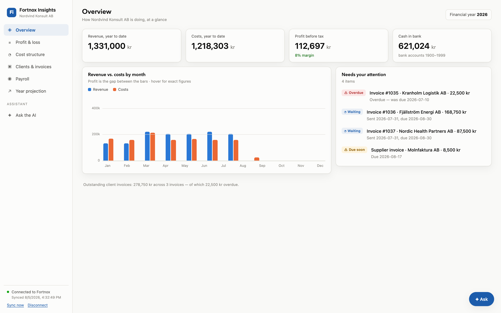
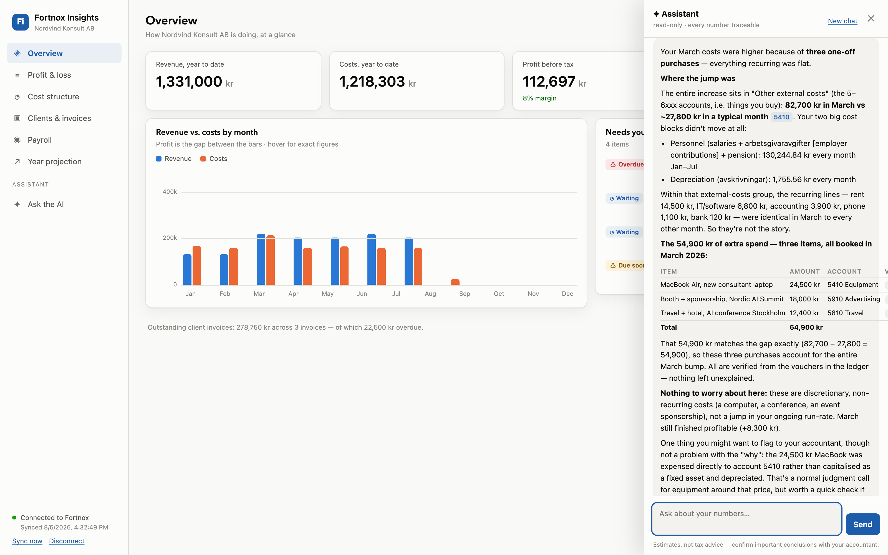

# Fortnox Insights

**Understand your Swedish company's finances — without being an accountant.**

A local, read-only web app that mirrors your [Fortnox](https://www.fortnox.se)
bookkeeping into SQLite and turns it into plain-language dashboards, a
drill-down P&L and balance sheet, payroll and cost analysis — plus an AI
assistant that answers questions about your books with cited, verified
numbers.

Built at an AI-consulting company, with no finance background and almost
entirely by an AI coding agent, to answer one question: *what is actually
going on in my company's books?* The story and method are in
[docs/HOW_THIS_WAS_BUILT.md](docs/HOW_THIS_WAS_BUILT.md).



## What it does

- **Overview dashboard** — revenue/costs/profit YTD, cash, outstanding and
  overdue invoices, an "attention" list of things that need action.
- **P&L for humans** — the resultaträkning grouped by BAS class, every line
  in plain language, three clicks from any number to the underlying voucher.
- **Balance sheet, account explorer, voucher viewer** — every figure in your
  accountant's report can be opened and traced.
- **Cost structure** — recurring vs one-off detection, burn rate, runway.
- **Payroll** — salaries, employer contributions, pension reconstructed from
  the ledger's L-series vouchers (no payroll API scope needed).
- **Clients** — revenue per client, concentration risk, payment behavior.
- **✦ Ask — the AI assistant** — ask in plain English ("why were costs higher
  in March?", "is our VAT balance right?"). It queries the local mirror with
  structured tools + read-only SQL, verifies Swedish tax rules against
  Skatteverket and other authoritative sources, does exact decimal arithmetic,
  runs its draft past an independent auditor agent, and cites every figure
  ([voucher:A/57@2026], [source:…]) as clickable links.



## Try it in 2 minutes — no Fortnox account needed

Demo mode runs the full app (including the AI chat) on a seeded, fictional
Swedish AB — Nordvind Konsult AB, two people, two years of coherent
double-entry books:

```bash
git clone https://github.com/menodataai/fortnox_app && cd fortnox_app
cp .env.example .env

cd backend
python3 -m venv .venv && .venv/bin/pip install -r requirements.txt
.venv/bin/python -m scripts.seed_demo          # builds backend/data-demo/
DEMO_MODE=1 .venv/bin/uvicorn app.main:app --port 8000

# second terminal
cd frontend && npm install && npm run dev      # → http://localhost:5173
```

For the AI chat, add an `OPENROUTER_API_KEY` to `.env`
([get one here](https://openrouter.ai/keys); any model id works via
`AI_MODEL`), and optionally a `TAVILY_API_KEY` for online rule verification.
Everything else works without any keys.

## Connect your real Fortnox

1. Create an app in the [Fortnox Developer Portal](https://developer.fortnox.se),
   register the redirect URI `http://localhost:8000/auth/callback`, and enable
   the scopes listed in `.env.example` (`FORTNOX_SCOPES`).
2. Put the Client ID/Secret in `.env`, set `DEMO_MODE=0`, restart the backend.
3. Open the app, click **Connect to Fortnox**, approve — the first sync runs
   automatically (~6–10 API calls for the entire ledger, thanks to the SIE
   export).
4. Recommended: copy `context/COMPANY_CONTEXT.example.md` to
   `context/COMPANY_CONTEXT.md` (gitignored) and fill in your company's
   verified facts — it makes the AI assistant dramatically better.

## Architecture

```
fortnox_app/
├── backend/             # Python 3.12 · FastAPI
│   ├── app/
│   │   ├── db.py            # SQLite mirror schema (WAL, read-only AI handle)
│   │   ├── sync.py          # Fortnox → mirror via SIE export
│   │   ├── sie.py, bas.py   # SIE parser · BAS chart-of-accounts semantics
│   │   ├── analytics.py     # P&L, balance sheet, costs, payroll, clients…
│   │   ├── fortnox/         # OAuth2 flow + async REST client (GET-only)
│   │   ├── ai/              # Pydantic AI agent: tools, prompt, verifier, SSE
│   │   └── routers/         # /auth /api/sync /api/dashboard /api/chat …
│   ├── scripts/seed_demo.py # fictional-company generator (demo mode)
│   └── tests/               # offline — agent loop runs on TestModel, 0 tokens
├── frontend/            # React + Vite + TypeScript (types generated from OpenAPI)
├── context/             # AI grounding: Swedish tax reference, glossary,
│                        #   COMPANY_CONTEXT.example.md (yours is gitignored)
├── context-demo/        # the fictional demo company's grounding file
└── docs/                # design docs, proposals, this-was-built-by-AI story
```

Principles (the long version is in [docs/ARCHITECTURE.md](docs/ARCHITECTURE.md)
and [docs/AI_DESIGN.md](docs/AI_DESIGN.md)):

- **Read-only by construction.** The app never writes to Fortnox (the client
  only implements GET). The AI never sees Fortnox credentials and only gets a
  read-only SQLite connection (`mode=ro` + `query_only` + a SELECT-only
  authorizer).
- **Local mirror.** All screens and AI answers run on local SQLite — fast,
  rate-limit-safe, and your data stays on your machine. The only things that
  leave it are the AI prompts/tool results sent to the model you configure.
- **Verified, never assumed.** Tax parameters that carry a conclusion are
  fetched live from an allowlist of authoritative Swedish sources and cited;
  computed answers pass through an independent auditor agent first. The
  quality bar was set by real audit questions over the author's own books —
  answered end-to-end, traced, and turned into test fixtures (the method is
  described in [docs/HOW_THIS_WAS_BUILT.md](docs/HOW_THIS_WAS_BUILT.md)).

## Roadmap

- [x] F1–F7: dashboard, P&L, account explorer, costs, clients, payroll, projection
- [x] F8: AI assistant over the mirror + online rule verification, cited sources
- [x] F9: answer-quality hardening (auditor pass, reference docs, sandboxed Python)
- [ ] F10: report analyzer — cross-check the accountant's quarterly/yearly PDFs
- [ ] Live sync via Fortnox WebSockets · more VAT/payroll setups · Swedish UI

Details in [docs/FEATURES.md](docs/FEATURES.md). Contributions welcome — see
[CONTRIBUTING.md](CONTRIBUTING.md).

## About

I'm **Keven (Qi Wang)** — I run an AI-consulting company in Sweden. I
built this for myself and open-sourced it because most small-company owners
have the same blindfold on. Find me on
[LinkedIn](https://www.linkedin.com/in/kevenqiwang/).

**Not tax advice.** The app explains and estimates; your accountant owns the
books. MIT licensed — see [LICENSE](LICENSE).
